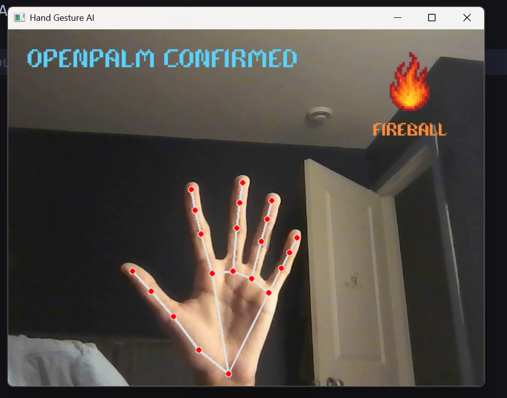
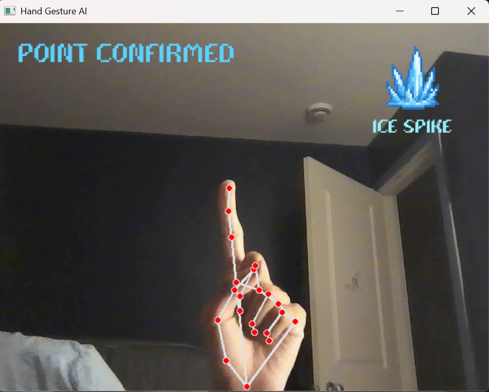
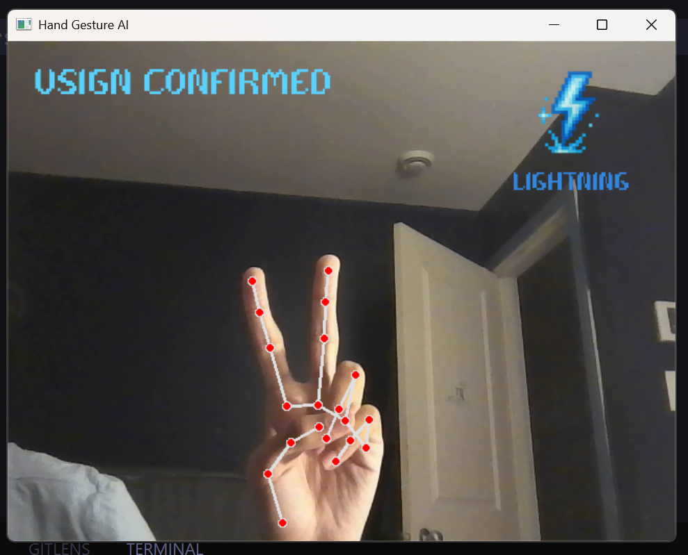

# Spellmotion-Gesture-AI

**Cast spells with your hands!** Spellmotion-Gesture-AI is a real-time hand gesture recognition system that transforms your hand movements into magical spells for gaming. Using computer vision and machine learning, this Python application detects and classifies hand gestures, sending spell commands to a connected Unity game via WebSocket communication.

This project works in conjunction with the [Spellmotion-Unity](https://github.com/ben4ali/Spellmotion-unity) game client to create an immersive gesture-based spell casting experience.

## Gesture Gallery

### Supported Gestures

  |
  |
  |

## Technologies Used

- **Computer Vision**: OpenCV for camera capture and image processing
- **Hand Detection**: MediaPipe for robust hand landmark detection
- **Real-time Communication**: WebSockets for seamless Unity integration
- **UI/Graphics**: Pillow (PIL) for image manipulation and custom UI elements
- **Python**: Core application development with modular architecture

## How It Works

### 1. **Hand Detection**

The system uses MediaPipe's hand detection model to identify and track hand landmarks in real-time from your camera feed.

### 2. **Gesture Classification**

Custom gesture classification algorithms analyze the relative positions of hand landmarks to determine which spell gesture is being performed.

### 3. **Gesture Confirmation**

A confirmation system ensures gestures are held for a minimum duration before triggering spells, preventing accidental casting.

### 4. **Spell Transmission**

Confirmed spells are sent to the Unity game client via WebSocket connection, enabling real-time spell casting in-game.

### 5. **Visual Feedback**

The application provides real-time visual feedback with:

- Hand landmark visualization
- Gesture recognition status
- Spell casting confirmation
- Progress indicators

## Installation & Setup

### Prerequisites

- Python 3.8 or higher
- Webcam/Camera device
- [Spellmotion-Unity](https://github.com/ben4ali/Spellmotion-unity) game client (optional)

### Installation Steps

1. **Clone the repository**

   ```bash
   git clone https://github.com/ben4ali/Spellmotion-Gesture-ai.git
   cd Spellmotion-Gesture-ai
   ```

2. **Install dependencies**

   ```bash
   pip install -r requirements.txt
   ```

3. **Run the application**

   ```bash
   python src/main.py
   ```

## Unity Integration

This AI system is designed to work with the [Spellmotion-Unity](https://github.com/ben4ali/Spellmotion-unity) game client. The WebSocket server runs on `localhost:8765` by default and sends spell data in the following format:

```json
{
  "type": "spell",
  "spell": "FIREBALL",
  "gesture": "OPENPALM"
}
```